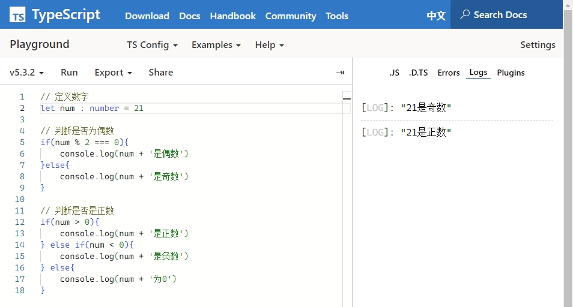
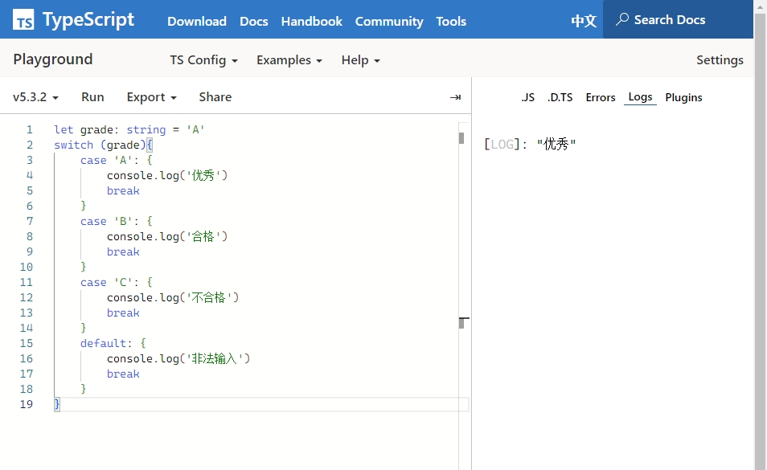
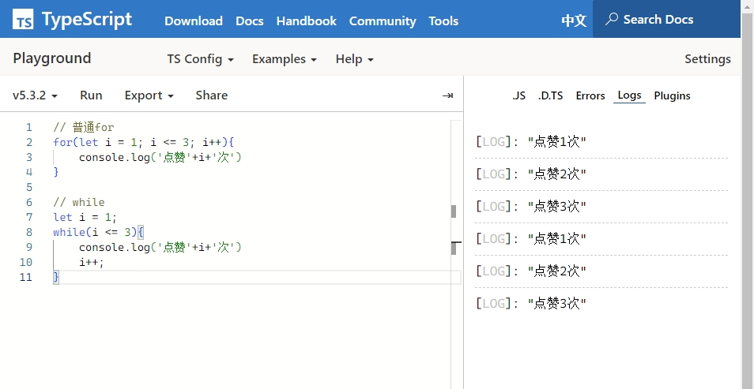

# TypeScript基础语法

## 变量声明

+ TypeScript在JavaScript的基础上加入了静态类型检查功能，因此每个变量都有固定的数据类型。

```typescript
// string：字符串，可以单引号或者双引号
let msg : string = 'hello world'

// number：数值，整数，浮点数都可以
let age : number = 21

// boolean：布尔
let finished : boolean = true

// any: 不确定类型，可以是任意类型
let a : any = 'jack'
a= 21

// union: 联合类型，可以是多个指定类型中的一种
let u: string|number|boolean = 'rose'
u = 18

// Object: 对象
let p = {name: 'Jack', age: 21}
console.log(p.name)
console.log(p['name'])

// Array: 数组，元素可以是任意其它类型
let names: Array<string> = ['Jack','Rose']
let ages: number[] = [21,18]
console.log(names[0])

```


## 条件控制

+ TypeScript与大多数开发语言类似，支持基于if-else和switch的条件控制。
+ 在TypeScript中，空字符串、数字0、null、undefined都被认为是false，其它值则为true

```typescript
// 定义数字
let num : number = 21

// 判断是否为偶数
if(num % 2 === 0){
    console.log(num + '是偶数')
}else{
    console.log(num + '是奇数')
}

// 判断是否是正数
if(num > 0){
    console.log(num + '是正数')
} else if(num < 0){
    console.log(num + '是负数')
} else{
    console.log(num + '为0')
}
```



```typescript
let grade: string = 'A'
switch (grade){ 
    case 'A': {
        console.log('优秀')
        break
    }
    case 'B': {
        console.log('合格')
        break
    }
    case 'C': {
        fconsole.log('不合格')
        break
    }
    default: {
        console.log('非法输入')
        break
    }
}
```



## 循环迭代

+ TypeScript支持for和while循环，并且为一些内置类型如Array等提供了快捷迭代语法。

```typescript
// 普通for
for(let i = 1; i <= 3; i++){
    console.log('点赞'+i+'次')
}

// while
let i = 1;
while(i <= 3){
    console.log('点赞'+i+'次')
    i++;
}
```


